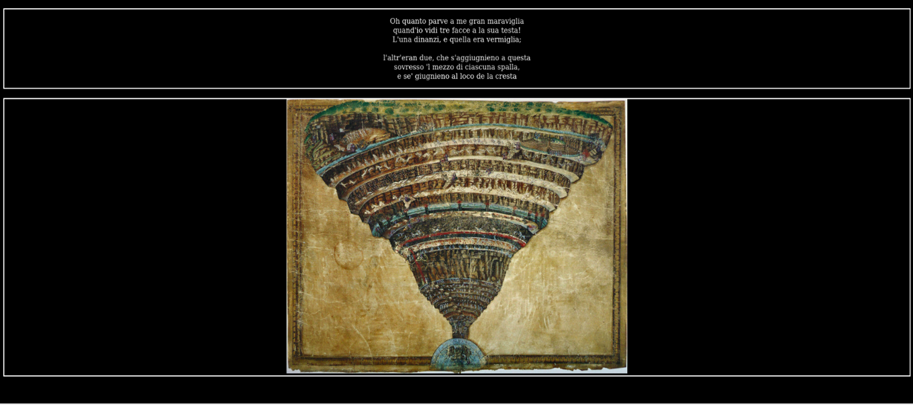

# INFERNO SVELATO: UN VIAGGIO ATTRAVERSO LE FASI DELL’ATTACCO

## INTRODUZIONE
Il report fornisce un'analisi dettagliata di una demo in cui è stato simulato un attacco alla macchina virtuale "Inferno" scaricata da Vulnhub Labs. L'obiettivo della dimostrazione era di illustrare praticamente le tecniche di penetration testing e le vulnerabilità comuni nella cybersecurity. "Inferno" è una macchina virtuale progettata per l'apprendimento e la pratica del penetration testing, offrendo un ambiente simulato per sviluppare competenze nel rilevamento e nell'exploit di vulnerabilità informatiche. Dal punto di vista pratico si richiedeva di trovare le due hash keys, una associata all'utente 'user' (contenuta nel file local.txt) e l'altra all'utente 'root' (contenuta nel file proof.txt), presenti nella macchina al fine di acquisire i privilegi di amministratore ('root'). Per eseguire la demo, sono state utilizzate due macchine virtuali: "Kali Linux" e "Inferno", configurate per creare un ambiente di test idoneo.

## RECONNAISSANCE
Ho iniziato individuando su quale indirizzo IP si trovasse la macchina “Inferno”. Dopo di che, cercando tale indirizzo sul browser è apparsa la seguente pagina web statica:

